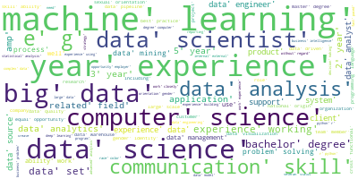

# Job-Description-Skills-Extractor
Given a job description, the model uses POS, Chunking and a classifier with BERT Embeddings to determine the skills therein.
You can find the Medium article with a full explanation here: https://medium.com/@johnmketterer/automating-the-job-hunt-with-transfer-learning-part-1-289b4548943
<ol>
  <li> JD Skills Preprocessing: Preprocesses and cleans indeed dataset, analysis is  
  <li> POS & Chunking EDA: Identified the Parts of Speech within each job description and analyses the structures to identify patterns that hold job skills 
  <li> regex_chunking: uses regex expressions for Chunking to extract patterns that include desired skills
  <li> extraction_model_build_trainset: python file to sample data (extracted POS patterns) from pickle files
  <li> extraction_model_trainset_analysis: Analysis of training data set to ensure data integrety beofre training
  <li> extraction_model_training: trains model with BERT embeddings
  <li> extraction_model_evaluation: evaluation on unseen data both data science and sales associate job descriptions; predictions1.csv and predictions2.csv respectively
  <li> extraction_model_use: input a job description and have a csv file with the extracted skills; hf5 weights have not yet been uploaded and will also automate further for down stream task
</ol>

Further readme description, hf5 weights, pickle files and original dataset to be added soon

Data procured from: 
 <ul>
   <li>data/collected_data/indeed_job_dataset.csv (Training Corpus): https://www.kaggle.com/elroyggj/indeed-dataset-data-scientistanalystengineer
   <li>data/collected_data/skills.json (Additional Skills): https://github.com/microsoft/SkillsExtractorCognitiveSearch/tree/master/data
   <li>data/collected_data/za_skills.xlxs (Additional Skills): https://github.com/dnikolic98/CV-skill-extraction/tree/master/ZADATAK
 </ul>
